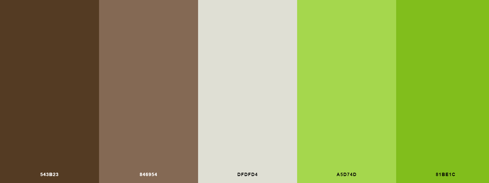

## User Experience

- ### User Stories

    As a **guest**, I want to be able to:

    1. View the latest hikes that have been added to the website.
    2. Register an account with the site so I can have the ability to view all of the hikes on the site and add my own.

    As a **registered user**, I want to be able to:
 
    1. Login to my account so I can create a new hike.
    2. By creating a new hike, I want to be able to:
        1. Give the hike a name.
        2. Add the hike area.
        3. Add the hike length.
        4. Add the approximate time it takes to complete the hike.
        5. Add some notes about the hike.
        6. Add a photo of the hike.
        7. Add the date I completed the hike.

    3. View all the hikes I have completed in a table that I can sort based on the hike length or time to complete.
    4. Search the table of hikes so I can filter the hikes based on the search terms.
    5. View each hike on a seperate page which shows all the information on the hike.
    6. Update the information of a hike I have added to the website.
    7. Delete a hike that I have added.
    8. View statistics about my hikes such as the total amount of hikes I have completed and the average length of all my hikes.
    9. View all the hikes on the website that other users have added and be able to search and filter these hikes.
    10. Have the opportunity to mark hikes that other users have added as completed and add them to the list of my completed hikes. 
 
    As an **admin**:

    In addition to the above, I want to be able to: 

    1. Edit a hike that has been added to the website by a user.
    2. Delete a hike that has been added to the website by a user.
    3. Add a new hike category to the website such as new hike areas and times.
   

- ### Wireframes

  The wireframes for this project were created using Balsamiq.

  - [Register](https://github.com/Johnny-Morgan/hike-logger/blob/master/static/wireframes/register.pdf).

  - [Login](https://github.com/Johnny-Morgan/hike-logger/blob/master/static/wireframes/login.pdf).
  
  - [Homepage](https://github.com/Johnny-Morgan/hike-logger/blob/master/static/wireframes/home.pdf).

  - [Hikes](https://github.com/Johnny-Morgan/hike-logger/blob/master/static/wireframes/all_hikes.pdf).

  - [Profile](https://github.com/Johnny-Morgan/hike-logger/blob/master/static/wireframes/profile.pdf).

  - [Hike](https://github.com/Johnny-Morgan/hike-logger/blob/master/static/wireframes/hike.pdf).

  - [Add Hike](https://github.com/Johnny-Morgan/hike-logger/blob/master/static/wireframes/add_hike.pdf).

- ### Design

  - #### Colour Scheme

    I used a green with brown colour scheme for this project which I obtained from [schemecolor](https://www.schemecolor.com/green-with-brown-color-combination.php).
    This palette has 5 colors which are Café Noir (#543B23), Pastel Brown (#846954), White Coffee (#DFDFD4), June Bud (#A5D74D) and Dark Lemon Lime (#81BE1C).
    
    

  - #### Typography

    [Montserrat](https://fonts.google.com/specimen/Montserrat) was chosen as the main font for this website with sans-serif as the fallback font.
