## User Experience

- ### User Stories

    As a **guest**, I want to be able to:

    1. View the latest hikes that have been added to the website.
    2. Register an account with the site so I can have the ability to view all of the hikes on the site and add my own.

    As a **registered user**, I want to be able to:
 
    1. Login to my account so I can create a new hike.
    2. By creating a new hike, I want to be able to:
        1. Give the hike a name.
        2. Add the hike area.
        3. Add the hike length.
        4. Add the approximate time it takes to complete the hike.
        5. Add some notes about the hike.
        6. Add a photo of the hike.
        7. Add the date I completed the hike.

    3. View all the hikes I have completed in a table that I can sort based on the hike length or time to complete.
    4. Search the table of hikes so I can filter the hikes based on the search terms.
    5. View each hike on a seperate page which shows all the information on the hike.
    6. Update the information of a hike I have added to the website.
    7. Delete a hike that I have added.
    8. View statistics about my hikes such as the total amount of hikes I have completed and the average length of all my hikes.
    9. View all the hikes on the website that other users have added and be able to search and filter these hikes.
    10. Have the opportunity to mark hikes that other users have added as completed and add them to the list of my completed hikes. 
 
    As an **admin**:

    In addition to the above, I want to be able to: 

    1. Edit a hike that has been added to the website by a user.
    2. Delete a hike that has been added to the website by a user.
    3. Add a new hike category to the website such as new hike areas and times.
   

- ### Wireframes

  The wireframes for this project were created using Balsamiq.

  - [Register](https://github.com/Johnny-Morgan/hike-logger/blob/master/static/wireframes/register.pdf).

  - [Login](https://github.com/Johnny-Morgan/hike-logger/blob/master/static/wireframes/login.pdf).
  
  - [Homepage](https://github.com/Johnny-Morgan/hike-logger/blob/master/static/wireframes/home.pdf).

  - [Hikes](https://github.com/Johnny-Morgan/hike-logger/blob/master/static/wireframes/all_hikes.pdf).

  - [Profile](https://github.com/Johnny-Morgan/hike-logger/blob/master/static/wireframes/profile.pdf).

  - [Hike](https://github.com/Johnny-Morgan/hike-logger/blob/master/static/wireframes/hike.pdf).

  - [Add Hike](https://github.com/Johnny-Morgan/hike-logger/blob/master/static/wireframes/add_hike.pdf).

- ### Design

  - #### Colour Scheme

    I used a green with brown colour scheme for this project which I obtained from [schemecolor](https://www.schemecolor.com/green-with-brown-color-combination.php).
    This palette has 5 colors which are Café Noir (#543B23), Pastel Brown (#846954), White Coffee (#DFDFD4), June Bud (#A5D74D) and Dark Lemon Lime (#81BE1C).
    
    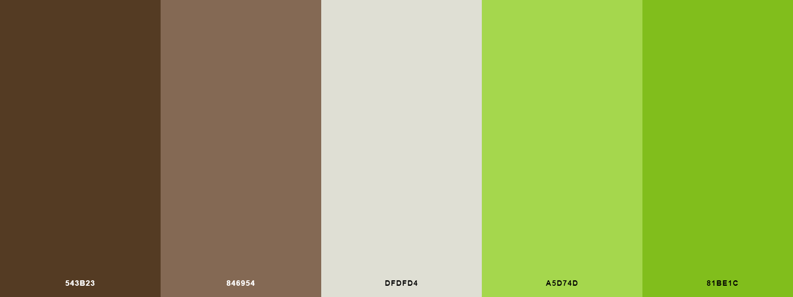

  - #### Typography

    [Montserrat](https://fonts.google.com/specimen/Montserrat) was chosen as the main font for this website with sans-serif as the fallback font.

## Features

### Existing Features

- ### Sitewide features

  - Responsive Bootstrap Navigation bar

    The links in the navigation bar change depending on the type of user visitng the site. For a guest or a user not logged in, the navbar displays links to the home page as well as the login and register pages. 

    

     For a logged in user, the navbar displays links to the home page, hikes page, profile page, add a hike page and the logout page. A welcome message is displayed with user's name.

    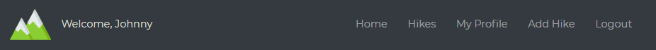

    For an admin, a link to the admin dashboard is displayed.

    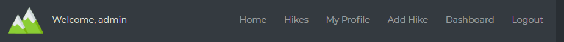

    The navigation is fully responsive with a hamburger icon and dropdown menu a feature for mobile devices.

    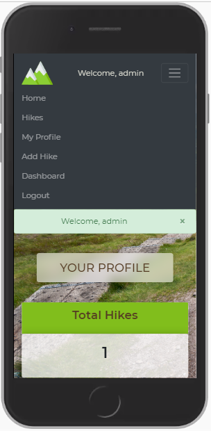

  - Footer with social media links.

  - Flash messages are featured across the site for when a user performs certain actions such as editing or deleting a hike.

  - Custom Error 403 page for if a non-admin user attempts to access the admin dashboard page.

  - Custom Error 404 page for if a user tries to open a page that does not exist.

- ### Home page

  

  The homepage shows the last 4 hikes hikes added to the website. For users that are logged in, a button is displayed with the text view. This button redirects the user to a page that displays more information about that hike. For guests to the website, the button is replaced with a login button which redirects the user to the login page. 

- ### Hikes page

  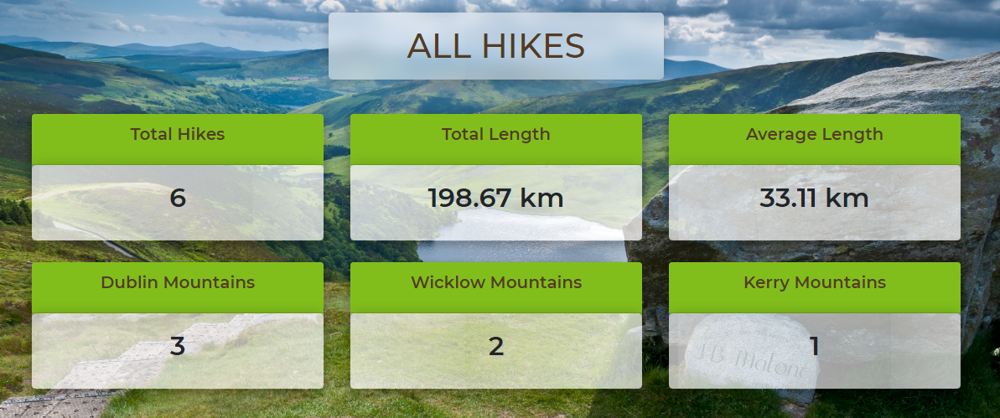

  The hikes page shows stats about all the hikes on the site. The stats include total number of hikes, total length of all the hikes combined and the average hike length. It also displays the number of hikes for each area.

  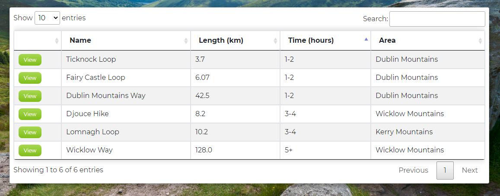

  A table is displayed below the hikes which contains all the hikes on the site. The table is responsive, a user can sort the table by clicking on the table headers. This is useful if the user wants to sort the hikes by length or time. A search bar is provided which allows the user to filter the hikes based on their search terms. This feature allows the user to see, for example, only hikes located in the Kerry area.

- ### Profile page

  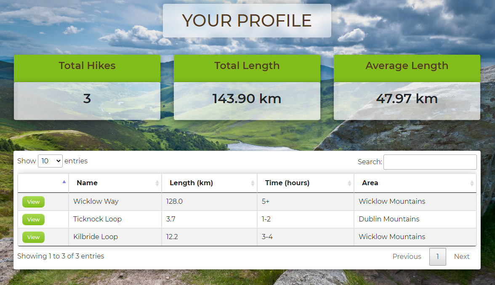

  The profile page is similar to the hikes pages with the difference being that the profile page show the stats and hikes relevant to the logged in user.

- ### Hike page

  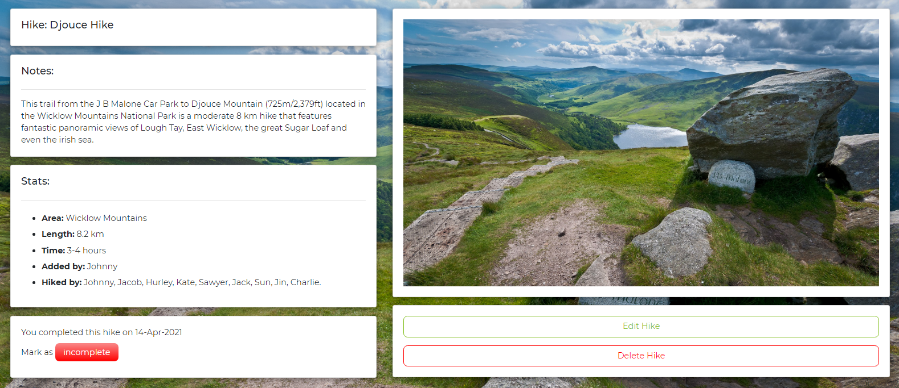

  Each hike on the site has its own page which displays the name, notes, stats and a picture of the hike. The stats section has a feature which displays all the registered users that have completed the hike. Below the stats card there is a card that displays the date that the logged in user completed the hike. The user can mark the hike as incomplete if they wish to do so.

  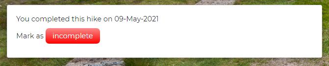
  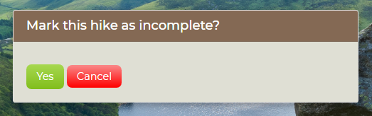

  If they have not completed the hike they have the option to do so by clicking on the complete button. This will redirect the user to a new page where they can choose a date for when they completed the hike. Marking a hike as complete will add the users name to the 'hiked by' list in the stats section. Marking a hike as incomplete will remove them from the list. 

  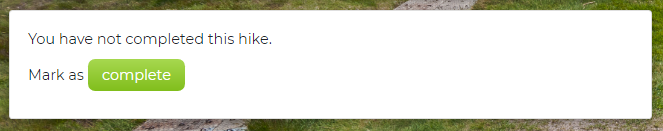
  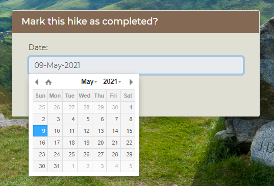

  The user has the option to edit or delete the hike provided they are the user who added the hike to the website. If they did not add the hike, the edit and delete buttons will not be visible to them. Clicking on the 'Edit Hike' button will redirect the user to a new page where a form is displayed with the current hike details.

  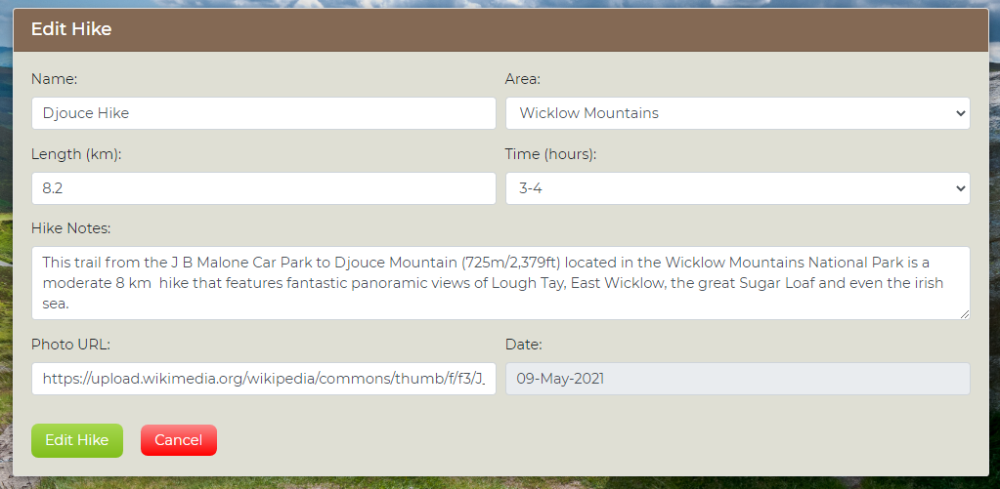

  Clicking on the 'Delete Hike' button will redirect the user to a new page to confirm they want to delete the hike.

  

## Technologies Used

### Languages Used

- [HTML5](https://en.wikipedia.org/wiki/HTML5)

- [CSS3](https://en.wikipedia.org/wiki/Cascading_Style_Sheets)

- [JavaScript](https://www.javascript.com/)

- [Python](https://www.python.org/)

### Frameworks, Libraries & Programs Used

- [Flask](https://flask.palletsprojects.com/en/1.1.x/)

  - Flask is the framework used to develop this website.

- [jQuery](https://jquery.com/)

  - jQuery is used to simplify the JavaScript code and DOM manipulation.

- [Bootstrap 4.5](https://getbootstrap.com/)

  - Bootstrap is used to assist with the responsiveness and styling of the website.

- [MongoDB](https://www.mongodb.com/)

  - MongoDB is used to store and retrieve the data used in this website.

- [GitPod](https://gitpod.io)

  - GitPod was used as the IDE for this project.

- [Git](https://git-scm.com/)

  - Git is used for version control by utilizing the Gitpod terminal to commit to Git and Push to GitHub.

- [GitHub](https://github.com/)

  - GitHub is used to store the project's code after being pushed from Git.

- [Balsamiq](https://balsamiq.com/)

  - Balsamiq is used to create the wireframes during the design process.

- [Google Fonts](https://fonts.google.com/)

  - Google Fonts is used to obtain the Montserrat font.

- [Font Awesome](https://fontawesome.com/)

  - Font Awesome is used to obtain the icons used in this website.

- [Autoprefixer](https://autoprefixer.github.io/)

  - Autoprefixer was used to add vendor prefixes.

- [GitHub Wiki TOC generator](https://ecotrust-canada.github.io/markdown-toc/)

  - Used to generate the table of contents in this document.

### Dependencies

- [click](https://click.palletsprojects.com/en/7.x/)

  - used for creating command line interfaces

- [dnspython](https://www.dnspython.org/)

  - Dnspython is a DNS toolkit for Python.

- [pymongo](https://pypi.org/project/pymongo/)

  - Contains tools for interacting with MongoDB database from python.

- [Flask-PyMongo](https://flask-pymongo.readthedocs.io/en/latest/)

  - Bridges Flask and PyMongo and provides some convenience helpers.

- [itsdangerous](https://readthedocs.org/projects/itsdangerous/)

  - Uses various helpers to pass data to untrusted environments and to get it back safe and sound. Data is cryptographically signed to ensure that a token has not been tampered with.

- [Werkzeug](https://werkzeug.palletsprojects.com/en/1.0.x/)

  - Werkzeug is a comprehensive WSGI web application library.