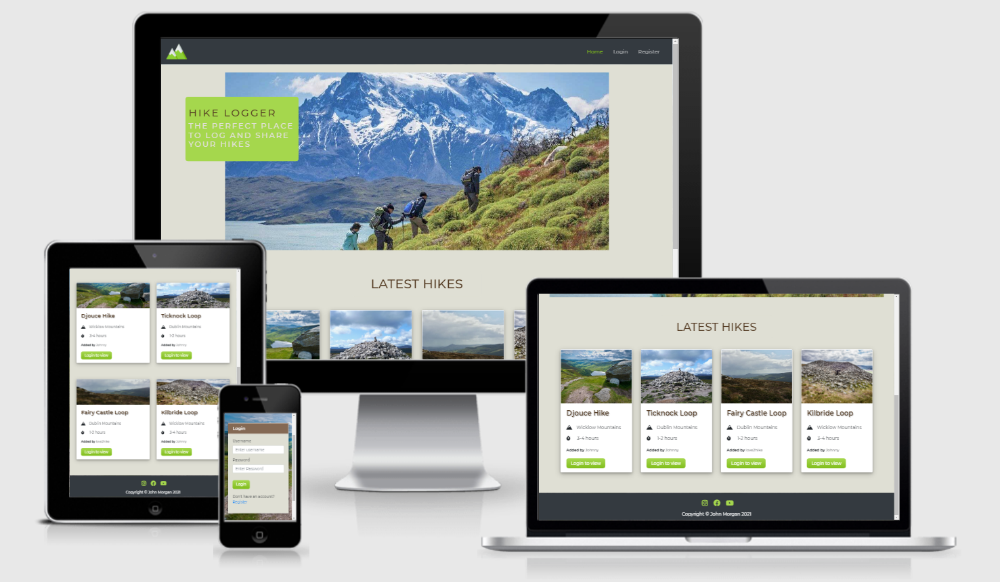
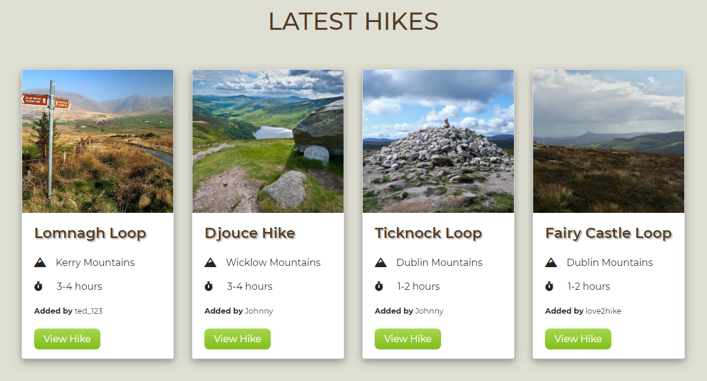

<div align="center">
    <a href="https://hike-logger.herokuapp.com/" target="_blank"></a>
    <h3><a href="https://hike-logger.herokuapp.com/" target="_blank">Click here</a> to view the site on Heroku.</h3>
</div>

## Table of Contents

1. [**Introduction**](#introduction)
2. [**User Experience**](#user-experience)
    - [**User Stories**](#user-stories)
    - [**Wireframes**](#wireframes)
    - [**Design**](#design)
3. [**Features**](#features)
    - [**Existing Features**](#existing-features)
    - [**Future Features**](#future-features)
5. [**Database Schema**](#database-schema)  
6. [**Technologies Used**](#technologies-used)  
7. [**Testing**](#testing)
8. [**Deployment**](#deployment)
9. [**Credits**](#credits)
10. [**Acknowledgements**](#acknowledgements)

## Introduction



Hike Logger is a website that allows hiking enthusiasts in Ireland to log and store details about the hikes they have undertaken. Users can also view their stats and view hikes that their fellow hikers have added to the site. Full CRUD functionality is a feature of the site allowing users to add, edit and delete hikes. 

## User Experience

- ### User Stories

    As a **guest**, I want to be able to:

    1. View the latest hikes that have been added to the website.
    2. Register an account with the site so I can have the ability to view all of the hikes on the site and add my own.

    As a **registered user**, I want to be able to:
 
    1. Login to my account so I can create a new hike.
    2. By creating a new hike, I want to be able to:
        1. Give the hike a name.
        2. Add the hike area.
        3. Add the hike length.
        4. Add the approximate time it takes to complete the hike.
        5. Add some notes about the hike.
        6. Add a photo of the hike.
        7. Add the date I completed the hike.

    3. View all the hikes I have completed in a table that I can sort based on the hike length or time to complete.
    4. Search the table of hikes so I can filter the hikes based on the search terms.
    5. View each hike on a separate page which shows all the information on the hike.
    6. Update the information of a hike I have added to the website.
    7. Delete a hike that I have added.
    8. View statistics about my hikes such as the total amount of hikes I have completed and the average length of all my hikes.
    9. View all the hikes on the website that other users have added and be able to search and filter these hikes.
    10. Have the opportunity to mark hikes that other users have added as completed and add them to the list of my completed hikes. 
 
    As an **admin**:

    In addition to the above, I want to be able to: 

    1. Edit a hike that has been added to the website by a user.
    2. Delete a hike that has been added to the website by a user.
    3. Add a new hike category to the website such as new hike areas and times.
   

- ### Wireframes

  The wireframes for this project were created using Balsamiq.

  - [Register](https://github.com/Johnny-Morgan/hike-logger/blob/master/static/wireframes/register.pdf)

  - [Login](https://github.com/Johnny-Morgan/hike-logger/blob/master/static/wireframes/login.pdf)
  
  - [Homepage](https://github.com/Johnny-Morgan/hike-logger/blob/master/static/wireframes/home.pdf)

  - [Hikes](https://github.com/Johnny-Morgan/hike-logger/blob/master/static/wireframes/all_hikes.pdf)

  - [Profile](https://github.com/Johnny-Morgan/hike-logger/blob/master/static/wireframes/profile.pdf)

  - [Hike](https://github.com/Johnny-Morgan/hike-logger/blob/master/static/wireframes/hike.pdf)

  - [Add Hike](https://github.com/Johnny-Morgan/hike-logger/blob/master/static/wireframes/add_hike.pdf)

  - [Dashboard](https://github.com/Johnny-Morgan/hike-logger/blob/master/static/wireframes/dashboard.pdf)

  Deviations from the wireframes.

  - On the registration page, the text under the text boxes was removed to give the registration form a cleaner look.

  - Guests do not have direct access to the hikes page. The hikes page was replaced with a home page. 

  - Social media links were added to the footer.

- ### Design

  - #### Colour Scheme

    I used a green with brown colour scheme for this project which I obtained from [schemecolor](https://www.schemecolor.com/green-with-brown-color-combination.php).
    This palette has 5 colours which are Café Noir (#543B23), Pastel Brown (#846954), White Coffee (#DFDFD4), June Bud (#A5D74D) and Dark Lemon Lime (#81BE1C).
    
    

  - #### Typography

    [Montserrat](https://fonts.google.com/specimen/Montserrat) was chosen as the main font for this website with sans-serif as the fallback font.

## Features

### Existing Features

- ### Sitewide features

  - Responsive Bootstrap Navigation bar

    The links in the navigation bar change depending on the type of user visiting the site. For a guest or a user not logged-in, the navbar displays links to the home page as well as the login and register pages. 

    

     For a logged-in user, the navbar displays links to the home page, hikes page, profile page, add a hike page and the logout page. A welcome message is displayed with the user's name.

    

    For an admin, a link to the admin dashboard is displayed.

    

    The navigation is fully responsive with a hamburger icon and dropdown menu a feature for mobile devices.

    


  - Footer with social media links.

  - Flash messages are featured across the site for when a user performs certain actions such as editing or deleting a hike.

  - Custom Error 403 page for if a non-admin user attempts to access the admin dashboard page.

  - Custom Error 404 page for if a user tries to open a page that does not exist.


- ### Home page

  

  The homepage shows the last four hikes added to the website. For users that are logged-in, a button is displayed with the text view. This button redirects the user to a page that displays more information about that hike. For guests to the website, the button is replaced with a login button which redirects the user to the login page. 


- ### Hikes page

  


  The hikes page shows stats about all the hikes on the site. The stats include the total number of hikes, the total length of all the hikes combined and the average hike length. It also displays the number of hikes for each area.


  

  A table is displayed below the hike stats which contains all the hikes on the site. The table is responsive, a user can sort the table by clicking on the table headers. This is useful if the user wants to sort the hikes by length or by time. A search bar is provided which allows the user to filter the hikes based on their search terms. This feature allows the user to see, for example, only hikes located in the Kerry area.


- ### Profile page

  

  The profile page is similar to the hikes pages with the difference being that the profile page shows the stats and hikes relevant to the logged-in user.


- ### Hike page

  

  Each hike on the site has its own page which displays the name, notes, stats and a picture of the hike. The stats section has a feature that displays all the registered users that have completed the hike. Below the stats card, there is a card that displays the date that the logged-in user completed the hike. The user can mark the hike as incomplete if they wish to do so.

  
  

  If they have not completed the hike they have the option to do so by clicking on the complete button. This will redirect the user to a new page where they can choose a date for when they completed the hike. Marking a hike as complete will add the user's name to the 'hiked by' list in the stats section. Marking a hike as incomplete will remove them from the list. 

  
  

  The user has the option to edit or delete the hike provided they are the user who added the hike to the website. If they did not add the hike, the edit and delete buttons will not be visible to them. Clicking on the 'Edit Hike' button will redirect the user to a new page where a form is displayed with the current hike details.

  

  Clicking on the 'Delete Hike' button will redirect the user to a new page to confirm they want to delete the hike.

  


- ### Add Hike page

  

  A form is provided for the user to add a hike. The user must add a hike name, area, length, time, hike notes, photo URL and a date. If the user does not fill out a section of the form and tries to submit the form, a message is displayed prompting the user to complete the required field. The form can be only be submitted once each field is filled correctly. A dropdown menu is provided for the areas and times. At present, the user has three choices to choose from for the area and time. Additional areas and times can be added by an admin account.
  
  
  
  


- ### Dashboard

  

  The admin dashboard is only accessible by admin users. Here the admin can add, edit or delete hike areas and times. 

### Future features

The following are elements that could be added to the site in future development:

- An option for a user to upload a hike to Google Maps or OpenStreetMap.

- A user can upload an image instead of a URL.

- A gallery of photos or each hike.

- A user can give each hike a rating.

- Forgotten password functionality.

- A contact form to contact the site owner.

- The ability for a user to mark a hike as complete multiple times, with a different date for each time.

- An option for a user to submit the exact time they took to walk a hike and use this information to calculate the users average speed. 

- An option for a user to submit additional hike statistics such as the elevation gain, total ascent or descent.

- A section for a user to store personal notes about the hike that they can keep private or mark as public should they wish to do so.

## Database Schema

  [MongoDB](https://www.mongodb.com/1) was chosen as the database for this project. The database contains 4 collections:

  - users
  
    |       Key     |         Data Type      |   Notes                                     |
    | :-----------: | :--------------------: | :-----------------------------------------: |
    | _id           |        ObjectId        |  This is automatically generated by MongoDB |
    | username      |        String          |  The username of the user, this is created when the user chooses their username at registration. |
    | password      |        String          |  The password of the user, this is created when the user chooses their password at registration. |

 - areas
  
    |       Key     |         Data Type      |   Notes                                     |
    | :-----------: | :--------------------: | :-----------------------------------------: |
    | _id           |        ObjectId        |  This is automatically generated by MongoDB |
    | name          |        String          |  The name of the area, an area is created by an admin through the admin dashboard |

 - times
  
    |       Key     |         Data Type      |   Notes                                     |
    | :-----------: | :--------------------: | :-----------------------------------------: |
    | _id           |        ObjectId        |  This is automatically generated by MongoDB |
    | time          |        String          |  The name of the time, a time is created by an admin through the admin dashboard |

 - hikes
  
    |       Key     |         Data Type      |   Notes                                     |
    | :-----------: | :--------------------: | :-----------------------------------------: |
    | _id           |        ObjectId        |  This is automatically generated by MongoDB |
    | name          |        String          |  The name of the hike                       |
    | area          |        String          |  The area of the hike                       |
    | length        |        Double          |  The length of the hike to two decimal places |
    | time          |        String          |  The approximate time the hike takes to complete |
    | added_by      |        String          |  The user who added the hike                |
    | img_url       |        String          |  A URL of an image of the hike              |
    | hiked_by      |        Array           |  An array of Objects representing the users who have completed the hike. Each object has a key containing a username and a corresponding value which is the date the hike was completed |

  


## Technologies Used

### Languages Used

- [HTML5](https://en.wikipedia.org/wiki/HTML5)

- [CSS3](https://en.wikipedia.org/wiki/Cascading_Style_Sheets)

- [JavaScript](https://www.javascript.com/)

- [Python](https://www.python.org/)

### Frameworks, Libraries & Programs Used

- [Flask](https://flask.palletsprojects.com/en/1.1.x/)

  - Flask is the framework used to develop this website.

- [jQuery](https://jquery.com/)

  - jQuery is used to simplify the JavaScript code and DOM manipulation.

  - It is also used for generating the data tables and date picker.

- [Bootstrap 4.5](https://getbootstrap.com/)

  - Bootstrap is used to assist with the responsiveness and styling of the website.

- [MongoDB](https://www.mongodb.com/)

  - MongoDB is used to store and retrieve the data used in this website.

- [Heroku](https://www.heroku.com/home)

  - Heroku is used to deploy this website.

- [GitPod](https://gitpod.io)

  - GitPod was used as the IDE for this project.

- [Git](https://git-scm.com/)

  - Git is used for version control by utilizing the Gitpod terminal to commit to Git and Push to GitHub.

- [GitHub](https://github.com/)

  - GitHub is used to store the project's code after being pushed from Git.

- [Balsamiq](https://balsamiq.com/)

  - Balsamiq is used to create the wireframes during the design process.

- [Google Fonts](https://fonts.google.com/)

  - Google Fonts is used to obtain the Montserrat font.

- [Font Awesome](https://fontawesome.com/)

  - Font Awesome is used to obtain the icons used in this website.

- [Autoprefixer](https://autoprefixer.github.io/)

  - Autoprefixer was used to add vendor prefixes.

- [GitHub Wiki TOC generator](https://ecotrust-canada.github.io/markdown-toc/)

  - Used to generate the table of contents in this document.

### Dependencies

- [click](https://click.palletsprojects.com/en/7.x/)

  - Used for creating command line interfaces.

- [dnspython](https://www.dnspython.org/)

  - Dnspython is a DNS toolkit for Python.

- [pymongo](https://pypi.org/project/pymongo/)

  - Contains tools for interacting with MongoDB database from python.

- [Flask-PyMongo](https://flask-pymongo.readthedocs.io/en/latest/)

  - Bridges Flask and PyMongo and provides some convenience helpers.

- [itsdangerous](https://readthedocs.org/projects/itsdangerous/)

  - Uses various helpers to pass data to untrusted environments and to get it back safe and sound. Data is cryptographically signed to ensure that a token has not been tampered with.

- [Werkzeug](https://werkzeug.palletsprojects.com/en/1.0.x/)

  - Werkzeug is a comprehensive WSGI web application library.

## Testing

The testing data for this project can be found in a separate file called [TESTING.md](https://github.com/Johnny-Morgan/hike-logger/blob/master/static/testing/TESTING.md).

## Deployment

### Clone the GitHub Repository

1. Log in to GitHub and locate the projects [repository](https://github.com/Johnny-Morgan/hike-logger/).
2. Click on the Code button which is located above the list of project files.
3. Copy the URL link located under the HTTPS tab.
4. Open a terminal in your IDE. [Visual Studio Code](https://code.visualstudio.com/) is recommended.
5. Change the current working directory to the location where you want the cloned directory.
6. Type `git clone`, and paste the URL you copied in Step 3. If you do not have git, download it [here](https://git-scm.com/).
7. Press Enter to create your local clone.
8. Further information can be found [here](https://docs.github.com/en/free-pro-team@latest/github/creating-cloning-and-archiving-repositories/cloning-a-repository).

### Create a Virtual Environment

1. cd to the project directory and tpye `python -m .venv venv` to create the new virtual environment.
2. Activate the virtual environment with the command `.venv\Scripts\activate.bat`

### Create a MongoDB database

1. Register an account at [MongoDB](https://www.mongodb.com/1).
2. Click on the 'Create a cluster' button (Starting at FREE option).
3. Select the aws cloud provider and the region closest to you from the options.
4. Choose a free cluster tier.
5. Select 'Cluster Name' and give your cluster a name (optional).
6. Click on the 'Create Cluster' button.
7. Click 'Database Access' and add a new database user.
8. Set Database User Privileges to 'Read and write to any database'.
9. Click Network Access, click Add IP Address and click Allow Access From Anywhere.
10. You can add your own data by following the [**Database Schema**](#database-schema).


### Create the Environment Variables

1. Create a .gitignore file and add the following: 

```python
  core.Microsoft*
  core.mongo*
  core.python*
  env.py
  __pycache__/
  *.py[cod]
  node_modules/
  .venv
```

2. Create an env.py in the same location as the projects app.py file. Add the following code making sure to add your own MONGO_URI, MONGO_DBNAME and SECRET_KEY. [This](https://randomkeygen.com/) is a useful site for generating secret keys.

```python
  import os

  os.environ.setdefault("IP", "0.0.0.0")
  os.environ.setdefault("PORT", "5000")
  os.environ.setdefault("MONGO_URI", <YOUR_MONGO_URI>)
  os.environ.setdefault("MONGO_DBNAME", <YOUR_MONGO_DBNAME>)
  os.environ.setdefault("SECRET_KEY", <YOUR_SECREY_KEY>)
```

### Deploy Locally

1. In your project terminal type `python app.py`
2. Hold down ctrl and click on the local host address in the terminal to open the site in a browser tab.

### Deploy to Heroku

The cloned repo should contain a requirements.txt file and a Procfile. If they are present skip to step 3 otherwise follow all the steps below:

1. Set up the requirements file by typing:
  `pip3 freeze --local > requirements.txt` and commit it to GitHub.
2. Set up the Procfile by typing `echo web: python app.py > Procfile` and commit it to GitHub.
3. Sign up or Login to [Heroku](https://id.heroku.com/login).
4. Click the 'New' button and choose 'Create new app'.
5. Add an app name, select your region and click the 'Create app' button.
6. For the Deployment method select the GitHub option to setup automatic deployment from you GitHub repository.
7. Make sure your GitHub profile is displayed, add the repository name and click the 'Search' button.
8. Once it finds your repo, click on the 'Connect' button.
9. Click on the Settings tab and click on the 'Reveal Config Vars' button.
10. Add the five variables from the env.py file that was created earlier.
11. Click the 'Enable Automatic Deploys' button and click the 'Deploy Branch' button.
12. Once your app is successfully deployed you can click the 'View' button to launch your app.

## Credits

### Code

- The glass effect was taken from [envatatotuts+](https://webdesign.tutsplus.com/tutorials/how-to-create-a-frosted-glass-effect-in-css--cms-32535).

- The password field regex pattern was taken [w3schools](https://www.w3schools.com/tags/tryit.asp?filename=tryhtml5_input_pattern3).

- The layout to control the position of the footer was taken from [freecodecamp](https://www.freecodecamp.org/news/how-to-keep-your-footer-where-it-belongs-59c6aa05c59c/).

- The code for the home page hero section was taken from the Code Institute [Love Running](https://www.youtube.com/watch?v=zI349F1o0YM&t=46s&ab_channel=MediaUpload) project.

- The [DataTables](https://cdn.datatables.net/) CDN was used to build the hike tables.

- The jQuery plugin to create the date picker was taken from [xdsoft](https://xdsoft.net/jqplugins/datetimepicker/).

- The code to dynamically set the active class for the navigation links was taken from [stackoverflow](https://stackoverflow.com/questions/55895502/dynamically-setting-active-class-with-flask-and-jinja2/55895621#55895621).

- The code for the 'role_required' decorator was taken from [stackoverflow](https://stackoverflow.com/questions/25233188/what-is-the-best-way-to-protect-a-flask-endpoint) and edited.

### Media

- The home page hero image is taken from [goworldtravel](https://www.goworldtravel.com/hiking-in-patagonia/).

- The background image is taken from [wikipedia](https://en.wikipedia.org/wiki/Wicklow_Way#/media/File:J_B_Malone_Memorial.jpg).

- The site logo and favicon is from [flaticon](https://www.flaticon.com/free-icon/mountains_762437?term=mountain&page=1&position=18&page=1&position=18&related_id=762437&origin=search).

## Acknowledgements

Thank you to my mentor Gerard McBride for his support and guidance during this project.

Thank you to the Code Institute Slack community for their advice and tips.

Thank you to the numerous family members and friends who tested the site.

> [Back to Top](#table-of-contents)