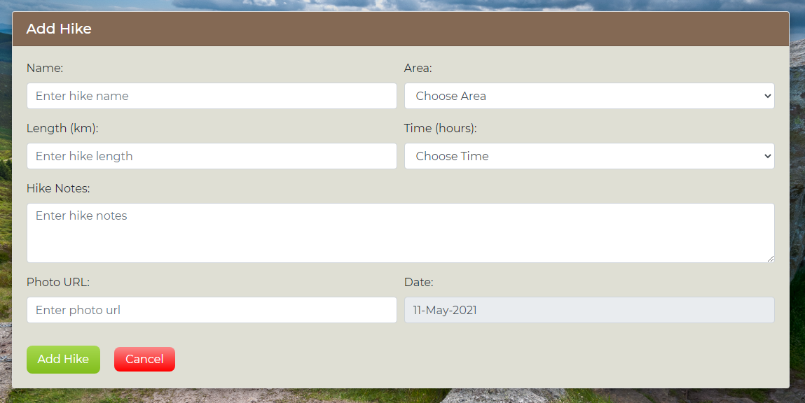

## Validation

### HTML

The [W3C Markup Validator](https://validator.w3.org/#validate_by_input) service was used to validate the HTML code of this project.

- [add_hike.html](https://github.com/Johnny-Morgan/hike-logger/blob/master/templates/add_hike.html) template errors:

    - *Bad value for attribute action on element form: Must be non-empty.* This error was resolved by completing the action attribute: 

        ``` html 
        action = "{{ url_for('add_hike') }}"
        ``` 
    - *The input type number is not allowed the attributes minlength and maxlength.* This error was resolved by removing these attributes.

    - *Bad value true for attribute readonly on element input.* This was resolved by changing the readonly attribute value to "readonly":

        ``` html 
        readonly="readonly"
        ``` 
    - *The value of the for attribute of the label element must be the ID of a non-hidden form control.* Resolved by changing the value of the for attribute to "picker":

        ``` html 
        <label for="picker">Date:</label>
        ``` 

- [complete_hike.html](https://github.com/Johnny-Morgan/hike-logger/blob/master/templates/complete_hike.html) template errors:

    - *Bad value true for attribute readonly on element input.* This was resolved by changing the readonly attribute value to "readonly":

        ``` html 
        readonly="readonly"
        ``` 
    - *The value of the for attribute of the label element must be the ID of a non-hidden form control.* Resolved by changing the value of the for attribute to "picker":

        ``` html 
        <label for="picker">Date:</label>
        ``` 
    
- [edit_hike.html](https://github.com/Johnny-Morgan/hike-logger/blob/master/templates/edit_hike.html) template errors:

    - *The input type number is not allowed the attributes minlength and maxlength.* This error was resolved by removing these attributes.

    - *Bad value true for attribute readonly on element input.* This was resolved by changing the readonly attribute value to "readonly":

        ``` html 
        readonly="readonly"
        ``` 
    - *The value of the for attribute of the label element must be the ID of a non-hidden form control.* Resolved by changing the value of the for attribute to "edit-date-picker":

        ``` html 
        <label for="edit-date-picker">Date:</label>
        ``` 
### CSS

The [W3C CSS Validator](https://jigsaw.w3.org/css-validator/#validate_by_input) service was used to validate the CSS code.

- 2 errors were found. These errors occured because the custom light-green and green variables were used in the linear-gradient function. This seems to be a quirk of the W3C CSS validator as discussed [here](https://stackoverflow.com/questions/64754909/css-validator-error-value-error-background-100-is-not-a-color-stop-value) on stackoverflow. A solution would be to replace the custom variables with the original hex values but I decided to leave the code as is, to make it easier to read and maintain.

- A total of 29 warnings were found. 

    - 1 warning related to the imported Google Fonts style sheet which can be safely ignored.
    - 5 of the warnings related to the custom colour variables which can be safely ignored.
    - 23 of the warnings related to the vendor prefixes. These prefixes are not within the W3C specification and can be safely ignored.
    


### JavaScript

[JSHint](https://jshint.com/) was used to validate the JavaScript code of the project.

- Four warnings for 'let' is available in ES6 (use 'esversion: 6') or Mozilla JS extensions (use moz). These warnings can be safley ignored.

- The jQuery $ symbols are declared as undefined variables. This can be safely ignored.


### Python

The [ExtendsClass](https://extendsclass.com/python-tester.html) Python syntax checker was used to check the Python code syntax, and find any errors. The code passed with no errors.


## Testing User Stories

- As a **guest**, I want to be able to:

    1. *View the latest hikes that have been added to the website.*

        The homepage contains the last four hikes to be added to the website. Each hike has a button with the text 'Login to view' which when clicked, redirects the guest to the login page. 
        
        

    2. *Register an account with the site so I can have the ability to view all of the hikes on the site and add my own.*

        A registration page is provided where a guest can register a new account. A registered user can then login and view all the hikes on the site. 

        

        A registered user that is logged in can then access the functionality to add a hike to the site.

        

-  As a **registered user**, I want to be able to:
 
    1. *Login to my account so I can create a new hike.*

        A login page is provided where a user enters their username and password to access the full website where they can add a new hike.

        

    2. *By creating a new hike, I want to be able to:*
        1. Give the hike a name.
        2. Add the hike area.
        3. Add the hike length.
        4. Add the approximate time it takes to complete the hike.
        5. Add some notes about the hike.
        6. Add a photo of the hike.
        7. Add the date I completed the hike.

        A form is provided for a user to add a hike. 
        - The hike name is inputted using a text field.
        - The hike area is chosen from a dropdwon menu.
        - The hike length is inputed using a number field. 
        - The hike time is chosen from a dropdwon menu.
        - The hike notes are inputed using a textarea field.
        - A url input is provided to add a link to a photo.
        - The hike date is chosen from a datepicker.

    3. *View all the hikes I have completed in a table that I can sort based on the hike length or time to complete.*

        A table is provided that shows each hike the user has completed and displays the hike name, length, time to complete and area. Clicking on the header of the length column will sort the hikes by length. Clicking on the time column will sort the hikes by their time. A user can also sort by the hike area or by the hike name should they wish to do so.

        
        
    4. *Search the table of hikes so I can filter the hikes based on the search terms.*
        
        The table of hikes contains a search bar where the user can search the table of hikes which will then be filtered based on the search results.

        

    5. *View each hike on a seperate page which shows all the information on the hike.*

        There is a button displayed beside each hike in the table that redirects the user to a separate page that displays all the hike information including the hike photo and other users who have completed the hike.

        

    6. *Update the information of a hike I have added to the website.*

        By clicking on the 'Edit Hike' button, a user can edit the details of the hike. Note that the user can only edit the hikes that they have added to the site. They cannot edit hikes that have been uploaded by other users.

        

    7. *Delete a hike that I have added.*

        By clicking on the 'Delete Hike' button, a user can delete the hike from the site. Note again that the user can only delete the hikes that they have added to the site. They cannot delete hikes that have been uploaded by other users.

        

    8. *View statistics about my hikes such as the total amount of hikes I have completed and the average length of all my hikes.*

        Each user has a profile page that displays the number of hikes they have completed, the total length of all the hikes they have completed and the average length of each hike.

        

    9. *View all the hikes on the website that other users have added and be able to search and filter these hikes.*

        There is a table in the 'Hikes' page which contains all the hikes that have been added to the site. The table can be sorted by clicking on the table headers and can be searched using the search bar.

    10. *Have the opportunity to mark hikes that other users have added as completed and add them to the list of my completed hikes.*

        On the page for each hike there is a 'complete' button that a user can click. This allows the user to mark the hike as complete and they can add the date they completed the hike. The hike is then added to the table in their profile page.
        
        
        

- As an **admin** I want to be able to: 

    1. *Edit a hike that has been added to the website by a user.*

        When logged in as an admin, the edit button is visible for every hike, which allows for the admin to edit all hikes. 
    
    2. *Delete a hike that has been added to the website by a user.*

        When logged in as an admin, the delete button is visible for every hike, which allows for the admin to delete all hikes. 

    3. *Add a new hike category to the website such as new hike areas and times.*

        When logged in as an admin, a navigation link to the dashboard is visible on the nav bar.

        

        The dashboard provides full CRUD functionality for the admin allowinbg them to create, view, edit and delete hike areas and times.

        

## Manual Testing on Live Site

### Navigation

- Checked the relevant navigation links were visible to a guest, a logged in user and an admin user.

- Checked all navigation links from the menu to confirm that they direct to correct pages.

### Registration page

- Attempted to register with a username that did not meet the relevent criteria to confirm that the correct warning message was displayed.

- Attempted to register with a password that did not meet the relevent criteria to confirm that the correct warning message was dispalyed.

- Registered as a new user and confirmed that the user was redirected to the hikes page and the correct flash message was displayed.

- Checked that the login link redirects to the login page.

### Login page

- Attempted to login with incorrect login credentials to confirm flash message was displayed.

- Checked that the registration link redirects to the registration page.

### Home page

- Confirmed that the latest hikes displayed were the last four hikes added to the database.

- Checked that the 'Login to view' buttons were visible to guests and redirect to the login page.

- Checked the 'View Hike' buttons are visible to logged in users and redirect to the relevant pages.

- Confirmed that the welcome message in the navbar displays the correct username.

### Hikes page

- Confirmed that the statistics displayed were calculated correctly.

- Confirmed that the table hikes contained all the hikes contained in the database.

- Confirmed that the 'View' button for each hike redirected to the correct page.

- Confirmed that the table of hikes was sortable by clicking on the table headers.

- Confirmed that the search feature of the hikes table was functioning correctly.

### Profile page

- Confirmed that the statistics displayed were calculated correctly.

- Confirmed that the table hikes contained only hikes that the logged in user had completed.

- Confirmed that the 'View' button for each hike redirected to the correct page.

- Confirmed that the table of hikes was sortable by clicking on the table headers.

- Confirmed that the search feature of the hikes table was functioning correctly.

### Hike page

- Confirmed that the correct hike information was displayed.

- Confirmed that the edit and delete buttons were only visible to the user that added the hike and visible to an admin user.

#### Complete hike feature

- Confirmed that the 'complete' button was only visible to users who had not completed the hike.

- Checked that the user was redirected to the complete_hike page when they clicked the complete button.

- Chose a date from the datepicker and clicked the 'Yes' button:

    - Confirmed that the user was added to the 'Hiked by' list displayed on the hike page.

    - Confirmed that the date the user completed the hike was displayed.

    - Confirmed that the 'hiked_by' field in the relevant hikes collection of the database was updated correctly.

    - Checked the correct flash message was displayed.

- Checked that clicking the 'Cancel' button on the complete_hike page redirects the user to the hike page.

#### Incomplete hike feature

- Confirmed that the 'incomplete' button was only visible to users who have completed the hike.

- Checked that the user was redirected to the incomplete_hike page when they clicked the incomplete button.

- Clicked the 'Yes' button and checked that the user was removed from the 'Hiked by' list displayed on the hike page and the correct flash message was displayed.

- Confirmed that the 'hiked_by' field in the relevant hikes collection of the database was updated correctly.

- Checked that clicking the 'Cancel' button on the incomplete_hike page redirects the user to the hike page.

#### Edit hike

- Clicked the 'Edit Hike' button to confirm user is redirected to the edit_hike page.

- Confirmed that the form was populated with the correct data.

- Clicked the 'Edit Hike' button:

    - Checked that the edited fields in the relevant hikes collection of the database was updated correctly.

    - Checked that the information about the hike on its hike page was updated correctly.

    - Confirmed that the correct flash message was displayed.

#### Delete hike

- Clicked the Delete button to confirm the user is redirected to the delete_hike page.

- Clicked the 'Yes' button:

    - Confirmed that the hike was deleted from the database.

    - Confirmed that the hike was removed from the table in the users profile page.

    - Confirmed that the stats of the user were updated to reflect the deletion of the hike.

    - Confirmed that the hike was removed from the table in the hikes page.

    - Confirmed that the correct flash message was displayed.

    - If the hike was one of the four latest hikes to be added to the database, it was confirmed that the latest hikes on the home page was updated.

- Checked that clicking the 'Cancel' button on the delete_hike page redirects the user to the hike page.


#### Add Hike page

- Clicked the 'Add Hike' button:

    - Confirmed warning message is displayed if any of the fields are left empty.

    - Checked that the hike is added to the hikes collection of the database.

    - Confirmed that the hike was added to the table in the users profile page.

    - Confirmed that the stats of the user were updated to reflect the addition of the hike.

    - Confirmed that the hike was added to the table in the hikes page.
    
    - Checked that the hike is added to latest hikes on the home page.

    - Confirmed that the correct flash message was displayed.

- Checked that clicking the 'Cancel' button redirects the user to the hike page.

#### Dashboard page

- Confirmed that a 403 error message is displayed if a non-admin user or guest attempts to enter the dashboard page.

- Confirmed all CRUD functionality for adding, editing and deleting a hike area was working correctly.

- Confirmed all CRUD functionality for adding, editing and deleting a hike time was working correctly.
